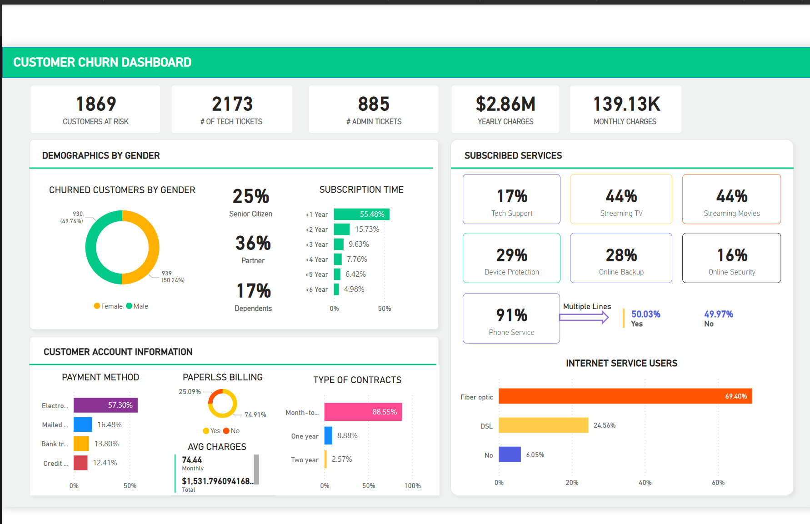

# 📊 Power BI Project – Telecom Customer Churn Analysis

## 🔍 Problem Statement

A leading telecom company is experiencing high customer churn, resulting in revenue loss and increased operational costs. To tackle this, an interactive Power BI dashboard was built to identify the drivers of churn, visualize customer behavior, and support strategic decision-making.

---

## 🎯 Business Objective

- Identify high-risk customer segments
- Understand root causes of churn
- Help the retention team take proactive actions (e.g., discounts, plan recommendations)
- Reduce churn and improve customer lifetime value through data-driven decisions

---

## 📁 Project Files

| File Name | Description |
|-----------|-------------|
| `02 Customer Churn-Dataset.xlsx` | Raw dataset containing customer and service details |
| `Project 1.pbix` | Power BI report with visual dashboards and DAX measures |
| `Dashboard.png` | Final dashboard view |
| `Customer Risk analysis.png` | Churn risk segmentation |
| `Insights.png` | Summary of actionable insights |
| `Email.png` | Example of a retention team email |
| `Power BI Problem Statement.pdf` | Problem statement and KPI breakdown |

---

## 📊 Visualizations

### 📌 1. Dashboard Overview

---

### 🔥 2. Customer Risk Analysis

Identifies at-risk segments based on combinations of contract type, tenure, service usage, and support availability.

---

### 💡 3. Key Insights

Summarizes major findings, such as which customers are most likely to churn and the role of tech support, online security, and payment method.

---

### 📬 4. Retention Email Sample

An example of how insights can be communicated to the retention or support team.

---

## 📈 KPIs Tracked

- ✅ **Churn Rate**
- 💰 **Monthly Revenue Loss due to Churn**
- 📉 **Churn by Contract Type, Tenure, Payment Method**
- 🎧 **Support Tickets vs. Churn**
- 📶 **Multiple Lines: Yes / No**
- 🛡 **Device Protection**
- ☁️ **Online Backup / Security**
- 🎬 **Streaming Movies / TV**
- 📞 **Phone Service**
- 👴 **Senior Citizen**
- 👪 **Dependents / Partner**

---

## 📌 Analytical Visuals Used

- Bar/Donut Charts: Churn by demographics (e.g., gender, senior citizen)
- Clustered Charts: Churn vs. Internet/Streaming Services
- Line Charts: Monthly charges trend vs. churn
- Matrix/Stacked Bar: Multi-variable churn segmentation
- Optional: Heat map of churn by geography

---

## 🧠 Tools & Technologies

- **Power BI Desktop**
- **Power Query** for data transformation
- **DAX** for KPI calculations
- **Microsoft Excel** for dataset input

---

## 🚀 Outcomes & Insights

- **Higher churn** in month-to-month contract customers
- **Senior citizens** and those **without tech support** are at higher churn risk
- **No online security/backup** usage correlates with higher churn
- **High charges** contribute to churn in specific segments
- Helps in crafting **targeted interventions**

---

## 📬 Communication Strategy

Insights are translated into action via email templates aimed at the retention team, enabling timely and personalized customer interactions.

---

## ✅ Conclusion

This Power BI solution provides business stakeholders with real-time monitoring of churn trends, at-risk customers, and performance metrics to:

- Improve customer retention
- Personalize outreach strategies
- Maximize revenue and customer satisfaction

